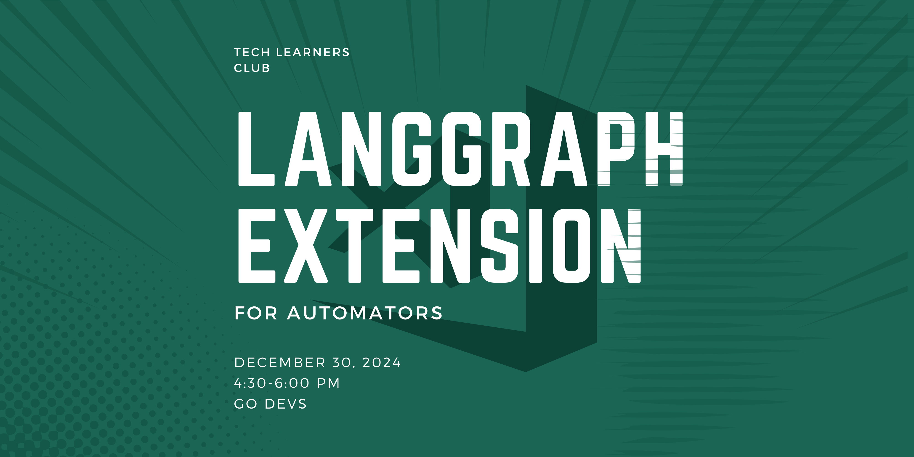
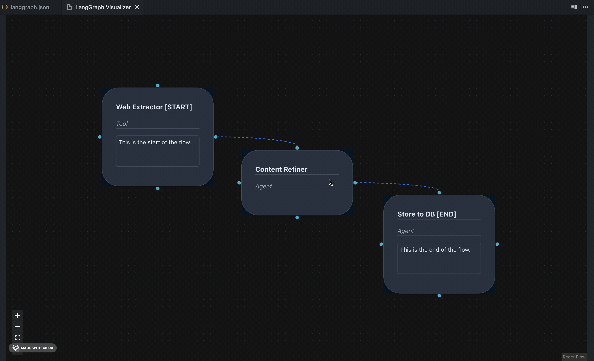

# LangGraph Visualizer

LangGraph Visualizer is a Visual Studio Code (VS Code) extension that provides real-time visual representations of multi-agent LangGraph projects. It enables developers to intuitively understand and monitor the flow and interactions of agents within their projects.

> **Note:** After Installation just use command ```cmd+shift+l```To se the Visual representaion


## Features

- **Real-Time Visualization:** Automatically updates the graph as the langgraph.json file changes, reflecting the current state of your project.

- **Interactive Interface:** Allows users to explore agent nodes and their connections within the graph.

- **Seamless Integration:** Easily integrates into your VS Code workflow, enhancing productivity without disrupting your development process.


## Directory Structure

```bash
.
├── CHANGELOG.md
├── README.md
├── eslint.config.mjs
├── images
│   └── Langgraph_header.png
├── media
│   ├── main.js
│   └── node.css
├── package-lock.json
├── package.json
├── src
│   ├── extension.ts
│   ├── test
│   │   └── extension.test.ts
│   └── webview
│       └── ext-app
│           ├── README.md
│           ├── package-lock.json
│           ├── package.json
│           ├── postcss.config.js
│           ├── public
│           │   ├── favicon.ico
│           │   ├── index.html
│           │   ├── logo192.png
│           │   ├── logo512.png
│           │   ├── manifest.json
│           │   └── robots.txt
│           ├── src
│           │   ├── App.css
│           │   ├── App.test.tsx
│           │   ├── App.tsx
│           │   ├── components
│           │   │   ├── CustomCard.tsx
│           │   │   ├── Diagram.tsx
│           │   │   ├── Graph.tsx
│           │   │   ├── InlineEditableText.tsx
│           │   │   └── ResourceSidebar.tsx
│           │   ├── global.d.ts
│           │   ├── index.css
│           │   ├── index.tsx
│           │   ├── logo.svg
│           │   ├── react-app-env.d.ts
│           │   ├── reportWebVitals.ts
│           │   └── setupTests.ts
│           ├── tailwind.config.js
│           └── tsconfig.json
├── tailwind.config.js
├── tsconfig.json
└── vsc-extension-quickstart.md
```

## Example



----
